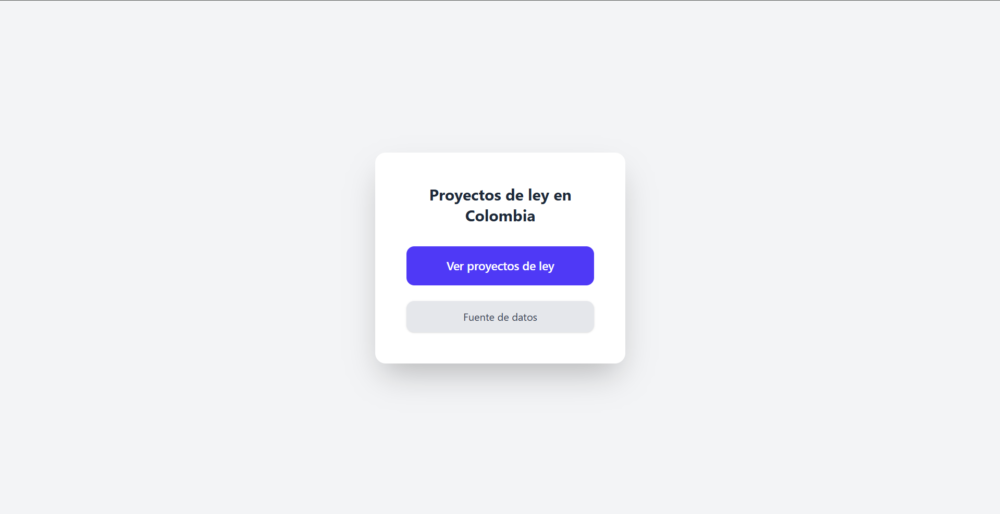
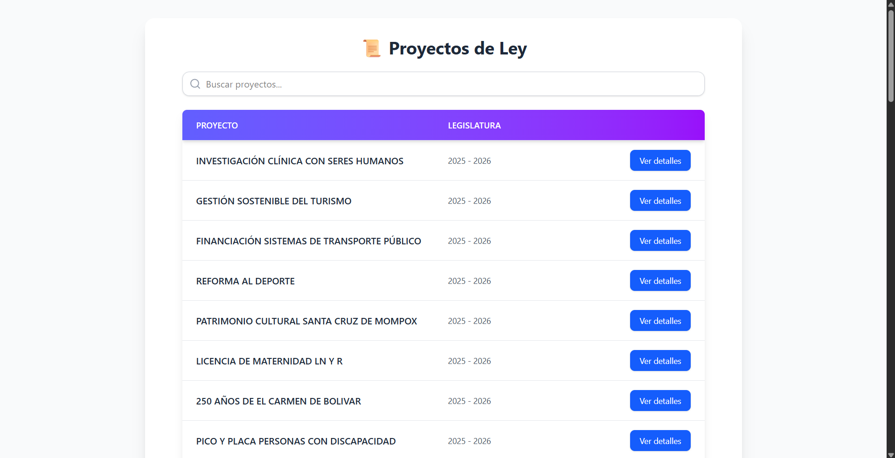
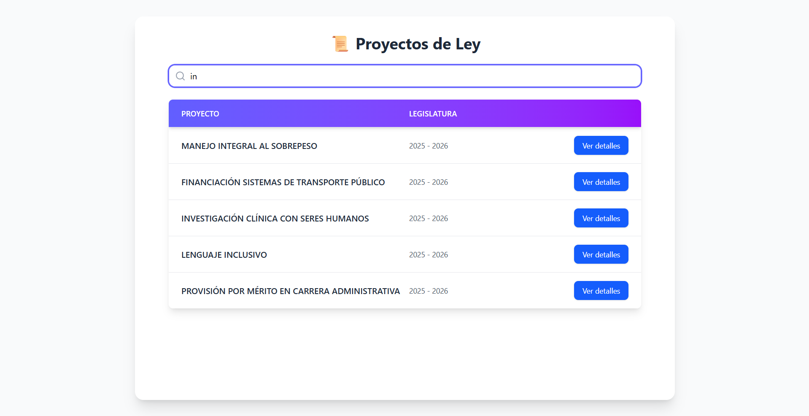
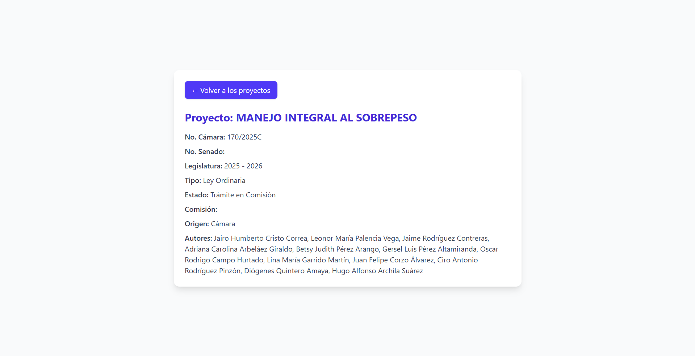

# Prueba Técnica – Proyectos de Ley de Colombia

## Descripción
Este proyecto extrae datos públicos de proyectos de ley en Colombia por medio de scraping, los normaliza y los expone mediante una API REST en FastAPI. Además, cuenta con un frontend sencillo en React para consultar los registros y ver detalles de cada proyecto.

Los datos utilizados se encuentran en la siguiente página: https://www.camara.gov.co/secretaria/proyectos-de-ley#menu

---

## Estructura del Proyecto

- database: Scripts de extracción y transformación de datos.
    * db: Estructura de la base de datos.
    * ETL: Scripts de extracción, transformación y carga de datos.
    * notebooks: Jupyter notebooks con pruebas de extracciones más complejas.
    * data: Datos extraidos con los notebooks.


## Requisitos

- Docker y Docker Compose
- Python 3.11+
- Node.js y npm (para frontend)

---

## Ejecución con Docker Compose

1. Levantar contenedores:

```bash
docker-compose up --build
```
2. Esto levantará:

- PostgreSQL en localhost:5432

- FastAPI en http://localhost:8000

3. La primera ejecución del ETL (contenedor etl) carga los datos automáticamente a la base de datos.

## API Endpoints

1. Listar todos los proyectos:

```bash
GET /proyectos/
```

Consultar proyecto por ID:

```bash
GET /proyectos/{id}
```

Filtrar por palabra clave:

```bash
GET /proyectos/?keyword=palabra
```

## Frontend

- Interfaz sencilla en React:

    * Tabla con todos los proyectos

    * Buscador por palabra clave

    * Ver detalles de un proyecto seleccionado

- Para correrlo:

```bash
cd frontend
npm install
npm run dev
```

## Diseño y Consideraciones

- ETL: Extrae los datos desde una fuente pública, los normaliza y los guarda en Postgres.

- API: FastAPI con endpoints REST para consultar y filtrar datos.

- Frontend: React, consulta la API y muestra los datos en tabla y detalle.

- Docker: Contenedores independientes para DB, backend y frontend para ejecución rápida y replicable.

- Filtros: Palabra clave en título y rango de fechas.

## Uso de IA

Se utilizó ChatGPT para:

- Generar la estructura inicial de FastAPI y endpoints.

- Asesoría sobre configuración de Docker Compose.

- Mejoras visuales con tailwindcss.

El código final fue adaptado manualmente y es totalmente entendible y mantenible.

## Capturas de pantalla

- Menú principal:



- Listado de proyectos de ley:



- Filtro de busqueda por título:



- Detalle de un proyecto de ley:

